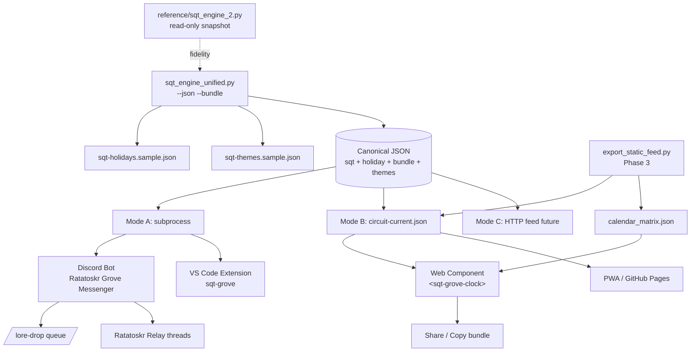
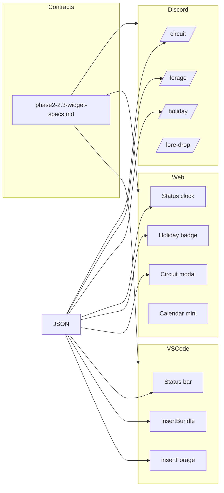

# Phase 2 Architecture Diagram

**Updated:** Segment 2.3 — widget integration layer added

## High-Level Data Flow



## Widget Boundary Layer (Segment 2.3)



## Module Boundaries

| Layer | Owner | Segment | Deliverable |
|-------|-------|---------|-------------|
| Engine | Jasper | 2.1 | `sqt_engine_unified.py` |
| Themes & bundles | Crystal + Jasper | 2.2 | `sqt-grove-style-guide.md`, themes JSON |
| **Widget contracts** | **Crystal + Jasper** | **2.3** | **`phase2-2.3-widget-specs.md`** |
| Static / PWA | Jasper + Crystal | 2.3 | `phase2-2.3-pwa-outline.md` |
| Curriculum | Cyber-SQRRL | 2.4 | Squirrel Ops labs in design_notes |

## Data Contract (widget-facing)

All three widgets read the same four top-level keys. Implementation must not parse `_extended` for production UI.

```
sqt_engine_unified.py --json --bundle
  → sqt { year, lunation, day, time }
  → holiday { id, name, type } | null
  → themes { palettes, motifs, style_modifiers, tone_keywords }
  → bundle { journal_prompt, mood_board, story_seed, art_prompt, foraging_idea }
```

## Resolved Design Questions (2.3)

| Question | Decision |
|----------|----------|
| Widget data source | Canonical engine JSON; static export for embeds |
| Trimmed vs display names | Trimmed default in status lines; `_extended.sqt_full` when available |
| Bundle depth per surface | Teaser default (Discord, web preview); full on explicit action |
| Upstream repo changes | None — all engine work stays in this exploration repo |

## Open Questions (Phase 3)

- Ratatoskr Relay persistence across lunation boundaries?
- LLM enrichment layer (optional) vs template-only bundles?
- Discord scheduled post cadence: SQT day boundary vs fixed Earth cron?

*Lightweight Reference: See Post_Project_Summary.md*