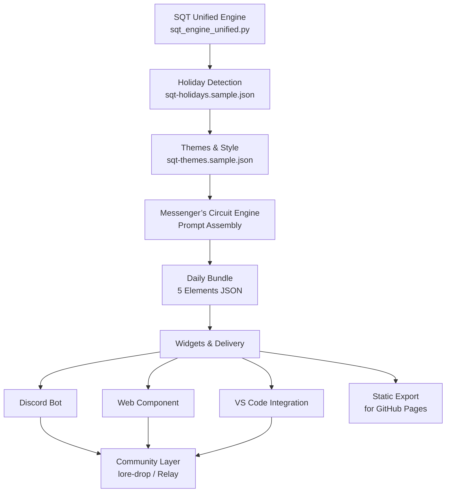

# Phase 2 Architecture Diagram (Initial)

## High-Level Data Flow (Mermaid)

## Module Boundaries (Phase 2 Focus)

1. **Engine Layer (Jasper)**
   - Pure SQT calculation + holiday lookup
   - Headless first, JSON output
   - Sample data loading

2. **Themes & Prompts Layer (Crystal + Jasper)**
   - sqt-themes.json driven
   - Tiered prompt assembly
   - Style Guide enforcement

3. **Presentation Layer (Crystal)**
   - Widgets UI/UX
   - PWA
   - Mood board examples

4. **Curriculum Layer (Cyber-SQRRL)**
   - Squirrel Ops mappings
   - Lab injection into foraging

## Open Design Questions for Phase 2
- Coexistence of trimmed names vs legacy in public dashboard?
- How much state (evolving protagonist) to keep in memory vs files?
- Static export frequency vs live calls?

*Update this diagram as Phase 2 progresses. Lightweight Reference: See Post_Project_Summary for SQT-Exploring-the-Possibilities.*
